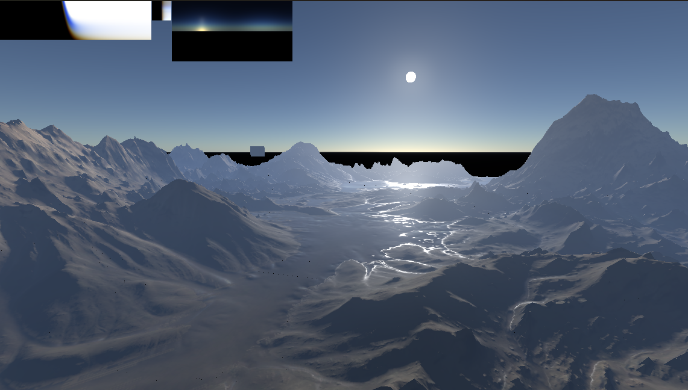

# Godot Precomputed Atmosphere

A compute shader implementation of precomputed atmospheric scattering, largely
based on the paper
"[A Scalable and Production Ready Sky and Atmosphere Rendering Technique](https://sebh.github.io/publications/egsr2020.pdf)"
by Sébastien Hillaire.

Currently, this does not implement aerial perspective or proper space views.

### Demo

<video src="screencast.mp4" width="500px" controls></video>

## Controls

The example scene provides a few convenience controls:

- WASD - movement
- Left mouse - rotate
- Right mouse - elevate / descend camera (nonlinear)
- Middle mouse - move sun position

## Performance

I ran a quick, non-comprehensive performance profile using NVIDIA Nsight
Graphics on an RTX 4090. The LUT generation dispatches took the following amount
of GPU time:

- Transmittance LUT - 0.007424ms
- MS LUT - 0.174304ms
- Skyview LUT - 0.008256ms

This is not reflective of final performance impact, as it doesn't include the
sky draw pass, and Godot itself does a lot of extra passes to generate cubemaps
from the sky shader.

In addition, the transmittance and MS LUTs don't need to be re-rendered each
frame unless the atmospheric parameters change (note, sun direction is not one
of these!), so disabling those passes if params haven't changed would be an easy
optimization.

## Attribution

- Debug menu - https://github.com/godot-extended-libraries/godot-debug-menu
- Terrain mesh -
  https://sketchfab.com/3d-models/death-valley-terrain-9f57bca156e14cff9e4e316a9ccc3e0d
